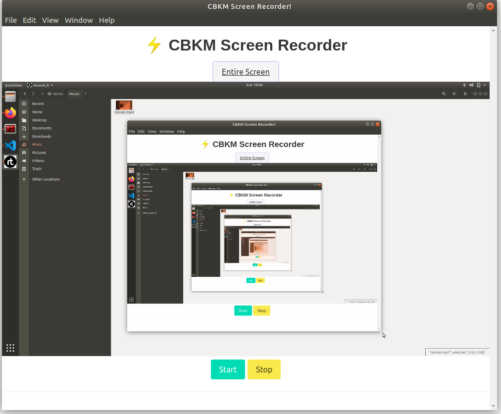
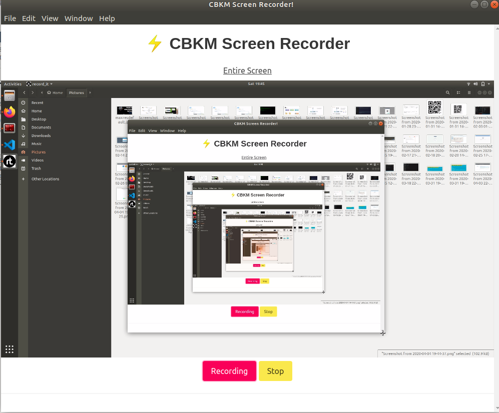
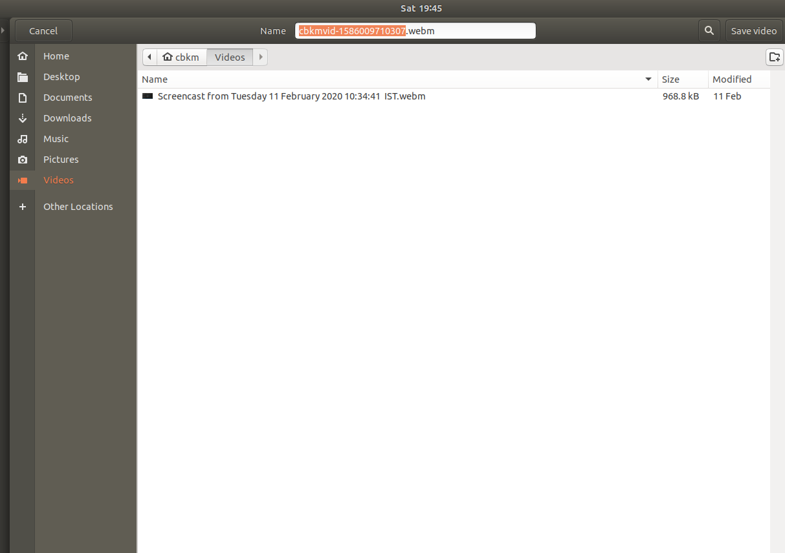

# Screen Recorder Desktop App

### This is a Desktop electron app where :-
- We can record our screen and window 
- And save and shre it  

### For Developer
`npm install`

`npm run watch` 

`electron-builder -wl`

### Screenshots

|||
|--|--|

 

 
